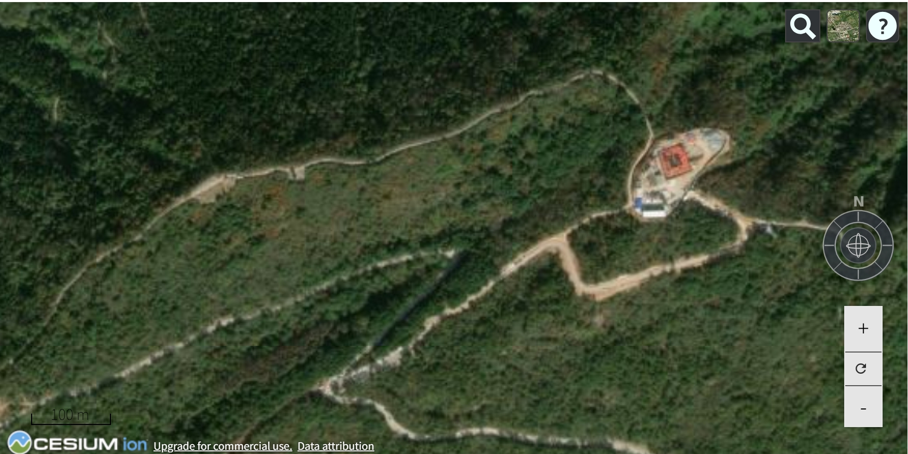

# Cesium 导航控件（指南针 + 缩放按钮）

> Cesium 导航控件（指南针 + 缩放按钮）的功能实现，从技术角度来看，可以整理出一整套实现流程和技术结构。这套流程结合了以下几个核心技术点：

## 整体功能目标

* 显示 指南针，旋转视角、轨道绕行
* 显示 缩放按钮（放大、缩小）
* 显示 重置按钮
* 支持 响应式更新 与交互
* 支持根据场景模式（2D/3D/Columbus）自动调整行为

## 实现流程一览图

```txt
[初始化 ViewModel (NavigationViewModel)]
         ↓
[准备控件数据 controls + 状态变量]
         ↓
[构建 HTML 模板字符串 (带 knockout 绑定)]
         ↓
[loadView() → 使用 Knockout 绑定到 DOM]
         ↓
[用户点击指南针/缩放按钮]
         ↓
[调用各控件的 activate() 方法]
         ↓
[执行 zoom(), rotate(), orbit(), resetView()]
         ↓
[相机控制：camera.move / flyTo / rotate / zoomIn]
```

## 最终实现的效果图



## 全部实现代码

[实现上述效果图的源码](https://github.com/HGX-DJK/CesiumNavigateTool)

### 使用简单讲解

- 在html文件中引用`CesiumNavigation.umd.js`和`cesium-navigation.css`

- 初始化viewer 调用`CesiumNavigation.umd(viewer, options)`

```javascript

var  viewer = new Cesium.Viewer("cesium-container", {
    geocoder: true,              //控制地图是否显示一个地理编码（geocoding）控件，允许用户搜索地点并定位到特定位置。
    homeButton: false,            //控制是否显示一个回到初始视图的按钮，允许用户快速返回到地图的初始状态
    animation: false,             //控制是否显示动画控件，允许用户播放、暂停或者改变时间。
    fullscreenButton: false,      //控制是否显示全屏按钮，允许用户切换地图进入或退出全屏模式。
    sceneModePicker: false,       //控制是否显示场景模式选择器，允许用户在 2D、3D 和 CV（Columbus View）模式之间切换
    timeline: false,              //控制是否显示时间轴控件，允许用户在时间上浏览数据。
    navigationHelpButton: true,  //控制是否显示导航帮助按钮，提供关于如何使用地图导航控件的帮助信息
    baseLayerPicker: true,       //控制是否显示基础图层选择器，允许用户选择不同的基础图层（如卫星影像、地图等）。
    infoBox: true,               //控制是否显示信息框，当用户点击地图上的对象时，会显示与该对象相关的信息。
    scene3DOnly: true,           //如果设置为true，则所有几何图形以3D模式绘制以节约GPU资源
    selectionIndicator: true,    //控制是否显示选择指示器，用于指示当前选择的地图对象。
    baselLayerPicker: true,      //控制是否显示基础图层选择器，允许用户选择不同的基础图层。
});

var options = {};

// 用于在使用重置导航重置地图视图时设置默认视图控制。接受的值是Cesium.Cartographic 和 Cesium.Rectangle.
options.defaultResetView = Cesium.Rectangle.fromDegrees(80, 22, 130, 50);
// 用于启用或禁用罗盘。true是启用罗盘，false是禁用罗盘。默认值为true。如果将选项设置为false，则罗盘将不会添加到地图中。
options.enableCompass = true;
// 用于启用或禁用缩放控件。true是启用，false是禁用。默认值为true。如果将选项设置为false，则缩放控件将不会添加到地图中。
options.enableZoomControls = true;
// 用于启用或禁用距离图例。true是启用，false是禁用。默认值为true。如果将选项设置为false，距离图例将不会添加到地图中。
options.enableDistanceLegend = true;
// 用于启用或禁用指南针外环。true是启用，false是禁用。默认值为true。如果将选项设置为false，则该环将可见但无效。
options.enableCompassOuterRing = true;

//添加自定义指南针和缩放控件的位置
options.compassPosition = {
    bottom:"11rem",
    right:"0rem"
};
options.zoomPosition = {
    bottom:"5rem",
    right:"2rem"
};
CesiumNavigation.umd(viewer, options);

```
